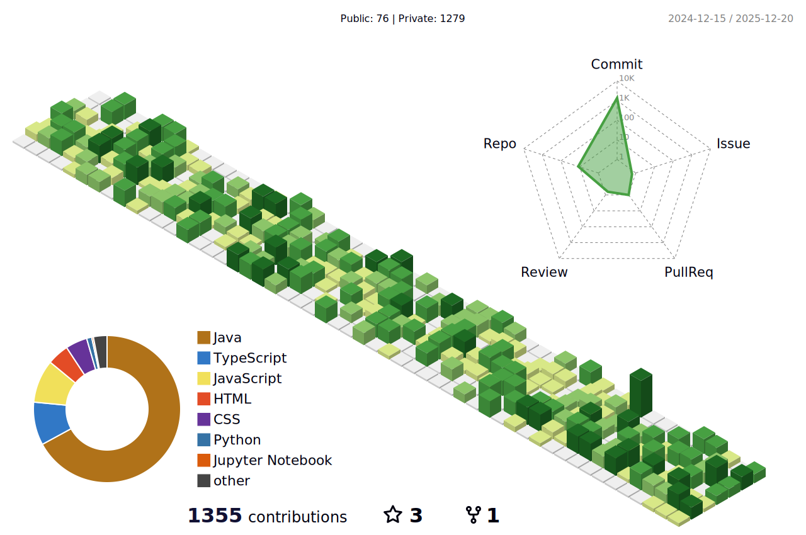

<h1 align="center"> 
    
</h1>

&nbsp;&nbsp;&nbsp;&nbsp;I am an **AI & Machine Learning Engineer** with strong hands-on experience in **Python**, **Computer Vision**, **Machine Learning**, and **Deep Learning**. My technical expertise spans **TensorFlow**, **PyTorch**, **Scikit-learn**, **Django**, **Flask**, and **Streamlit**. I enjoy building **real-world AI systems**, **data-driven applications**, and **LLM-based intelligent solutions**, with interests in **Computer Vision**, **NLP**, and **AI-powered automation**.

<table border="0" align="center">
  <tr border="0">      
    <td align="left">
💻    AI / Machine Learning Engineer  
       
⚡️     MCA (AIML) Graduate    
       
        
📝    <a href="https://erdincozdemirr.github.io/assets/Erdinc_Ozdemir_Java_Back_CV.pdf" target="_blank">My Resume!</a>    
 
🌐    <a href="https://erdincozdemirr.github.io" target="_blank">Visit My Website!</a> 
 
📫    <a href="mailto:er.parveen44@gmail.com">er.parveen44@gmail.com</a> 
 
👥    <a href="https://calendly.com/erdincozdemir/40min" target="_blank">Schedule Meeting!</a>   

  
  

   </td>
  <td style="display: block; margin: 0 auto;
    padding:0;">

  </td>
 </tr>
</table>

 
 
  <h2 align="center"> My Skill Set </h2>  

<table align="center">
<tr>
<td align="top" width="50%">
<h3 align="center">AI / ML & Data</h3>

</td>

<td valign="top" width="50%">
<h3 align="center">Backend & Frameworks</h3>

</td>
</tr>

<tr>
<td valign="top" width="50%">
<h3 align="center">Databases & Cloud</h3>

</td>

<td valign="top" width="50%">
<h3 align="center">Tools & DevOps</h3>

</td>
</tr>
</table>

 

<h3 align="center"> 📊 Parveen's Code Contributions</h3>  

## 📊 Parveen's Code Contributions

  

 

  
  
    

