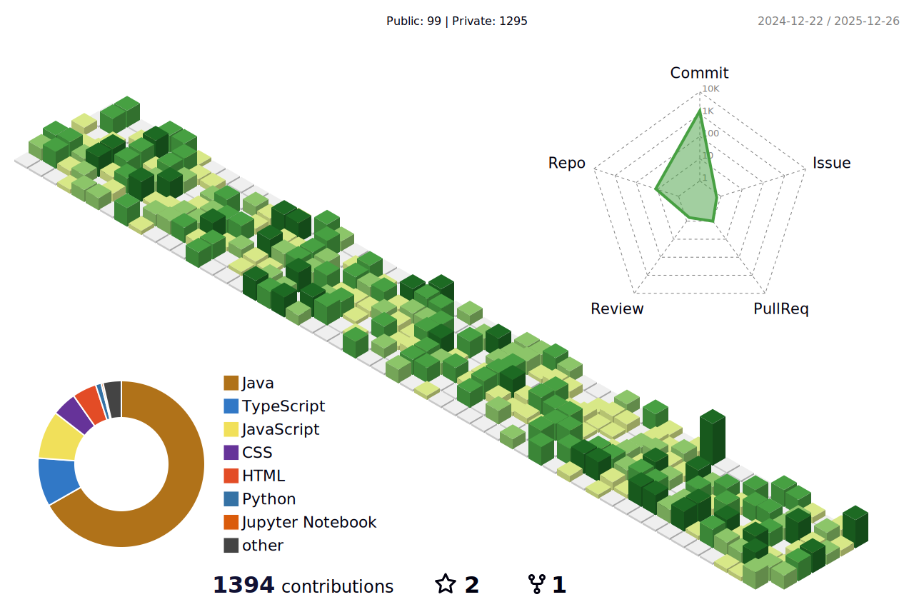

<h1 align="center"> 
    
</h1>

&nbsp;&nbsp;&nbsp;&nbsp;I am a software engineer in **Java development**, with a skill set that includes **Java 8+**, **Spring Boot**, **SQL**, **JPA/Hibernate**, **RESTful APIs** and **Spring Security**. I like to work on **Microservice** architecture. I have an interest in developing **Financial** and **Insurance** application.

<table border="0" width="100%">
  <tr border="0">
    <td width="30%" align="left" valign="middle">
      💻    Java Backend Developer  
      ⚡️     Software Engineer      
      📝    <a href="./assets/Erdinc_Ozdemir_Java_Back_CV.pdf">My Resume!
      </a>   
      📫    <a href="mailto:erdincozdemir1812@gmail.com">erdincozdemir1812@gmail.com</a> 
      👥    <a href="https://calendly.com/erdincozdemir/40min">Schedule Meeting!</a>   
    </td>
    <td width="70%" align="center" valign="middle">
      
    </td>
  </tr>
</table>

 
 
  <h2 align="center"> My Skill Set </h2>  
<table align="center">
<tr>
<td align="top" width="50%">
<h3 align="center">FrontEnd</h3>

</td>
<td valign="top" width="50%">
<h3 align="center">BackEnd</h3>

</td>
</tr>
<tr>
<td valign="top" width="50%">
<h3 align="center">DataBase</h3>

</td>
<td valign="top" width="50%">
<h3 align="center">Test & DevOps</h3>

</td>
</tr>
</table>
 

 
 

  
  

 
 
  
<h3 align="center"> 📊 Erdinc's Private Contributions</h3>  

 
 

 
 
