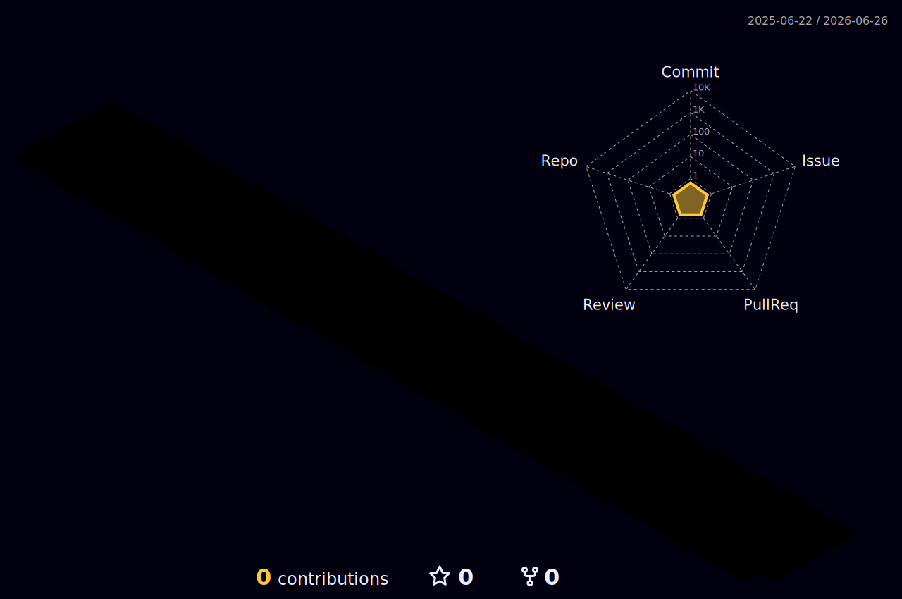

<!-- Top GIF Banner -->

  

<!-- Intro Typing Animation -->

  

---

<!-- Social & Profile Badges -->

  
  
  
  
  

---

<!-- Animated Roles Header -->

  

---

<!-- GitHub Stats Section -->

  
  

---

<!-- Contribution Graph -->

  

<!-- 3D Contribution Chart -->

  

---

<!-- Fun GIF Divider -->

  

---

<!-- Academic Note (Optional) -->

📚 Academic GitHub (2019 – 2022):  
<a href="https://github.com/1parveen">github.com/1parveen</a> — Maintained private repositories of lecture notes, learning projects, and college assignments.

---

<!-- Footer -->

  

